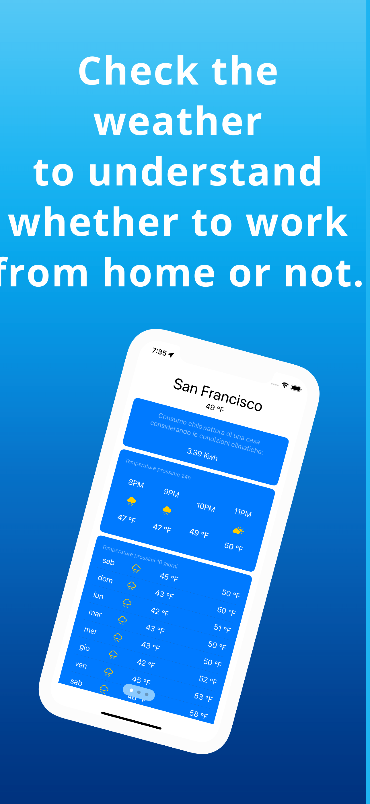
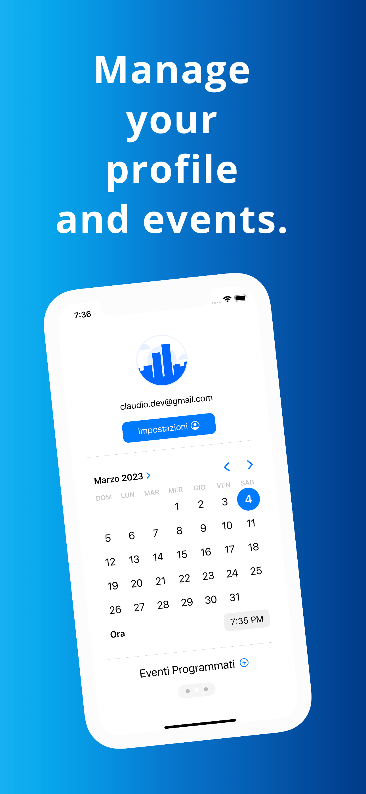
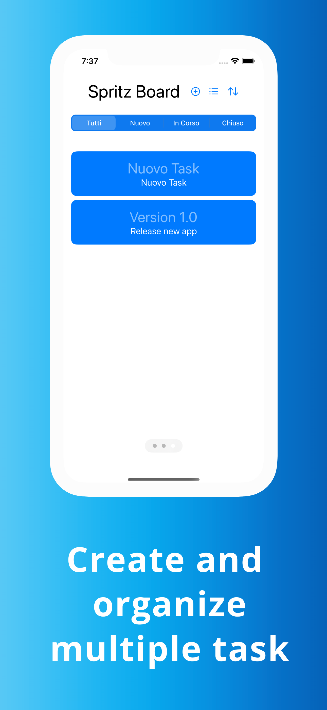

# Manhattan

<table style="width: 100%">
<tr>
<figure>
<th>

</th>
<th>

</th>
<th>

</th>
</figure>
</tr>
</table>

### 1. Futures

  - [x] Target IOS 16 and MacOS/Ipad
  - [x] No use Xib/Storyboard
  - [x] Support Iphone portrait
  - [x] Use MVVM pattern
  - [x] Use Modular architecture 
  - [x] Write Unit Test

### 1. Local Modular Library
   - [x] ManhattanCore: Package with API Model and Realm.
  
        - Codable Model.
        - Persisted Model.
        - Realm read/save/delete database object.

   - [x] ManhattanLogin: Package with Login.
  
        - Realm login.
        - Login Interface.

   - [x] ManhattanSignUp: Package with SignUp.
  
        - Realm signup.
        - SignUp Interface.

   - [x] ManhattanHome: Package with app Home.
  
        - Weather interface.
        - Profile interface.
        - Board interface.
                
# Other

### External Library
  
  - [x] Realm: Realm is a mobile database that runs directly inside phones, tablets or wearables.
  
        - Realm’s object-oriented data model is simple to learn, doesn’t need an ORM, and lets you write less code.
        - Realm’s local database persists data on-disk, so apps work as well offline as they do online.
        - Realm is fully-featured, lightweight, and efficiently uses memory, disk space, and battery life.
